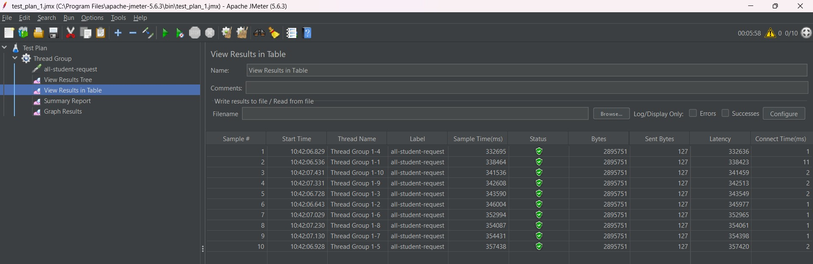
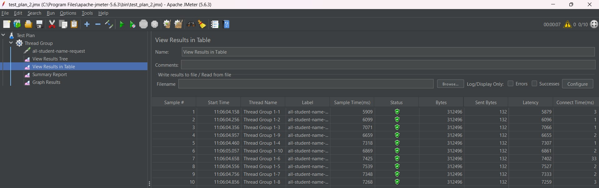
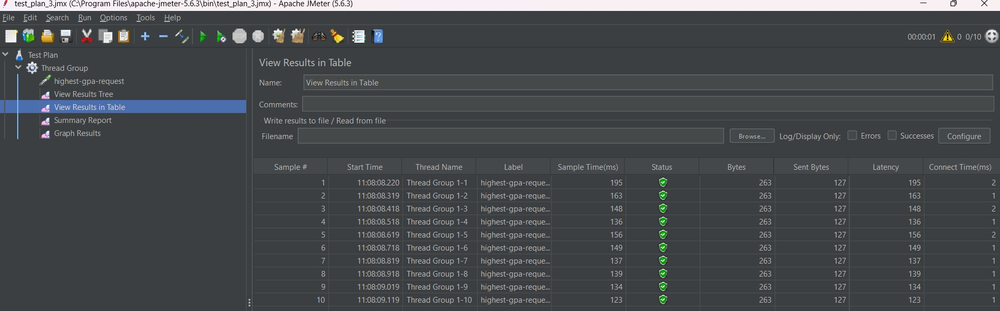
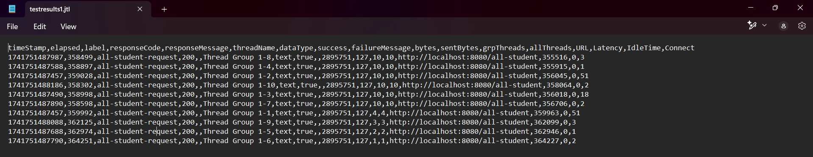
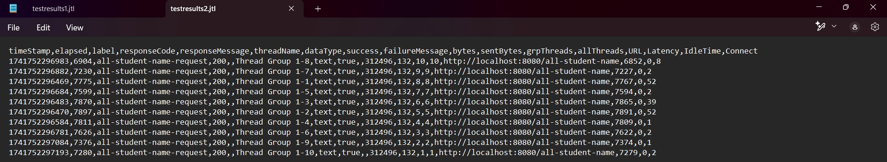
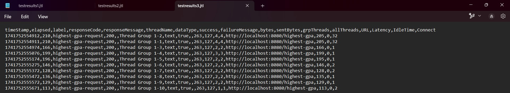
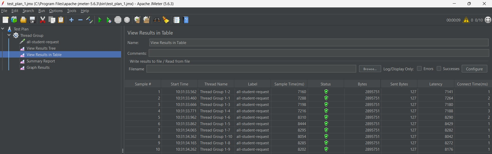
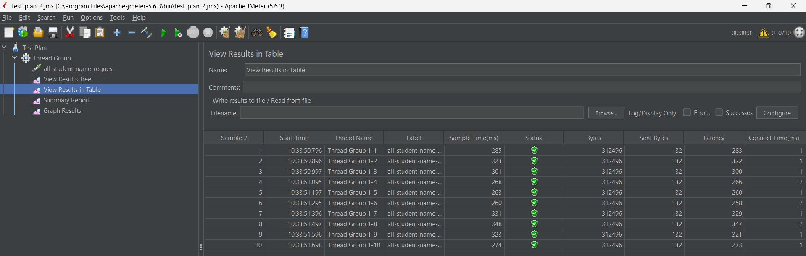

    <h1>MODULE 5</h1>

    

    <h2>Alwie Attar Elfandra</h2>
    <h2>2306241726</h2>

### ScreenShoot JMeter Test Plans Before Profiling
### GUI Version
#### Test Plan 1 (all-student)

#### Test Plan 2 (all-student-name)

#### Test Plan 3 (highest-gpa)

### CLI Version
#### Test Plan 1 (all-student)

#### Test Plan 2 (all-student-name)

#### Test Plan 3 (highest-gpa)

### ScreenShoot JMeter Test Plans After Profiling (Optimization)
#### Test Plan 1 (all-student)

#### Test Plan 2 (all-student-name)

#### Test Plan 3 (highest-gpa)

### Analisis dan Kesimpulan
Dari hasil Jmeter yang didapatkan dapat dilihat untuk masing-masing test_plan:
1. `all-student`

    - Pada test plan ini, latency yang menandakan waktu ditempuhnya request dieksekusi dalam code sebelum profiling mencapai
      300 ribu ms latency.

    - Setelah dilakukan profiling (optimisasi method getAllStudentWithCourses) dapat dilihat bahwa latency nya menurun hingga
      sekitar 7-8k-an ms latency.

   Hal ini menunjukkan bahwa dengan dilakukan profiling, waktu eksekusi code dapat dipercepat hingga lebih dari 20%. Berarti kita berhasil melakukan profiling pada method / test plan ini.

2. `all-student-name`

    - Pada test plan ini, latency yang dikeluarkan sebelum profiling sekitar 5-7k-an ms latency.
    - Setelah dilakukan profiling (optimisasi method joinStudentNames) dapat dilihat bahwa latency nya menurun hingga 200-300-an ms latency.

   Hal ini menunjukkan bahwa dengan dilakukan profiling, waktu eksekusi code dapat dipercepat hingga lebih dari 20%. Hal ini berarti kita berhasil melakukan profiling pada method / test plan ini.

3. `highest-gpa`

    - Pada test plan ini, latency yang dikeluarkan sebelum profiling sekitar 100-an ms latency.
    - Setelah dilakukan profiling (optimisasi method getStudentWithHighestGPA) dapat dilihat bahwa latency nya menurun hingga di bawah 31-an ms latency.

   Hal ini menunjukkan bahwa dengan dilakukan profiling, waktu eksekusi code dapat dipercepat hingga lebih dari 20%.
   Ini berarti kita juga telah berhasil melakukan profiling pada method / test plan ini.

## Refleksi
1. **What is the difference between the approach of performance testing with JMeter and profiling with IntelliJ Profiler in the context of optimizing application performance?**

    Pendekatan pengujian menggunakan JMeter tidak menyangkut cara program/aplikasi beroperasi. JMeter hanya perlu mengirim permintaan ke endpoint yang ditentukan dan menyesuaikan jumlah permintaan sesuai dengan permintaan penguji. Sehingga kita hanya akan mendapatkan data berupa berhasil/tidaknya request, waktu keseluruhan, dan memori keseluruhan saja.Di lain hal, dengan profiling menggunakan intelliJ, kita bisa mengetahui bagian program mana saja yang lebih lama berjalan dibandingkan dengan program lain sehingga kita bisa melakukan optimasi pada bagian-bagian kode kita yang memiliki waktu besar.

2. **How does the profiling process help you in identifying and understanding the weak points in your application?**

    Profiling membantu kita dalam mengetahui bagian program mana yang menghambat kinerja aplikasi secara keseluruhan (memory, cpu, time, etc). Dengan demikian, kita hanya perlu mengoptimasi bagian yang menghambat tersebut sehingga aplikasi secara keseluruhan akan meningkat kinerjanya dengan lebih baik tanpa perlu memperbaiki terlalu banyak bagian dari keseluruhan code nya.

3. **Do you think IntelliJ Profiler is effective in assisting you to analyze and identify bottlenecks in your application code?**

    Menurut saya iya, profiler Intelij efektif dalam membantu saya untuk menganalisa method atau kode mana yang mengalami kehambatan yang tidak diperlukan. Lebih dalamnya, dengan profiler Intellij, saya dapat mengetahui bagian program yang memakan waktu paling lama, seperti method getAllStudentWithCourses etc. Bahkan, dengan informasi durasi waktu yang diperlukan untuk mengoperasikan pemanggilan-pemanggilan fungsinya, saya dapat mendeteksi baris mana pada method tersebut yang menghambat kinerja methodnya.

4. **What are the main challenges you face when conducting performance testing and profiling, and how do you overcome these challenges?** 

    Menurut saya, membaca output dari alat pengujian performansi dan profiler merupakan tantangan besar. Diperlukan pemahaman yang mendalam untuk mengidentifikasi bagian program yang menjadi beban dari keseluruhan berjalannya program. Tentu solusinya adalah bisa dengan membiasakan diri dengan teknologi baru ini untuk lebih mudah mendapatkan informasi penting dari hasil outputnya.

5. **What are the main benefits you gain from using IntelliJ Profiler for profiling your application code?**

    Dengan bantuan profiler Intellij, kita dapat mengidentifikasi bagian program yang menjadi biang permasalahan, durasi eksekusi suatu metode, dan frekuensi pemanggilan metode. Ini memungkinkan kita untuk mengoptimalkan bagian program yang membutuhkan perhatian tanpa mengabaikan prinsip bahwa melakukan optimasi terlalu dini dapat mengurangi keterbacaan kode.

6. **How do you handle situations where the results from profiling with IntelliJ Profiler are not entirely consistent with findings from performance testing using JMeter?** 

    Untuk mengatasi ketidakkonsistenan hasil antara profilisasi menggunakan IntelliJ Profiler dan pengujian kinerja dengan JMeter, kita dapat menerapkan teknik seperti menggunakan Docker sebagai alternatif daripada .jmx serta memperhatikan think time. Dengan pendekatan ini, kita dapat meningkatkan keseragaman hasil pengujian JMeter sekaligus mengurangi variasi yang disebabkan oleh perbedaan mesin uji. Selain itu, membandingkan hasil dari kedua alat tersebut (JMeter & IntelliJ Profiler) juga menjadi langkah penting untuk mendapatkan pemahaman yang lebih jelas mengenai performa aplikasi serta faktor-faktor yang menyebabkan perbedaan hasil.

7. **What strategies do you implement in optimizing application code after analyzing results from performance testing and profiling? How do you ensure the changes you make do not affect the application's functionality?** 

    Apa yang saya lakukan sebelumnya adalah seperti setelah melakukan testing dan profiling, saya memperbaiki kode dengan memeriksa durasi program menggunakan JMeter. Jika terlalu lama, saya mengidentifikasi bagian kode yang menjadi masalah dan mengoptimalkannya. Saya memastikan kebenaran perubahan dengan membandingkan outputnya dengan sebelumnya.